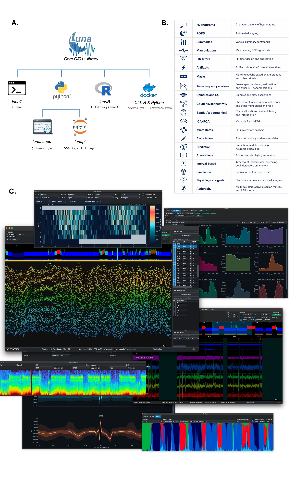

# Lunascope

**An interactive desktop application for sleep signal visualization, annotation, and analysis — built on the [Luna](http://zzz.nyspi.org/luna/) ecosystem.**



---

Lunascope is a native desktop application that puts Luna's full
analytical engine — the same one used in command-line and Python
workflows — behind an interactive graphical interface. Signals,
annotations, and derived outputs can be inspected, modified, and
re-analyzed within a single session, with changes propagated
immediately between the visual layer and the underlying data model.

Lunascope is aimed at sleep researchers, clinical scientists, and
trainees who need to review PSG recordings, manage annotations, run
automated staging, or explore cohort-level summaries without leaving
the graphical environment — while remaining able to drop into scripted
or batch analysis at any point.

---

## Features

- **Synchronized multichannel viewer** — pan and zoom across hours of EEG, EMG, EOG, and other channels with responsive decimated rendering
- **Hypnogram display** — color-coded sleep staging synchronized with the signal viewer
- **Spectral summaries** — per-channel power spectra and spectrograms updated on the fly
- **Annotation editor** — create, edit, and delete interval annotations; changes are immediately reflected in Luna's data model
- **Automated sleep staging** — POPS and SOAP models accessible directly from the interface
- **Cohort-level Explorer** — Hypnoscope alignment, annotation summaries, waveform displays, and table-based plots across a sample list
- **Moonbeam NSRR module** — import recordings directly from the National Sleep Research Resource into the analysis context
- **Embedded scripting console** — execute any Luna command and receive structured result tables without leaving the application
- **Command browser** — searchable Luna command and parameter reference with embedded documentation
- **Multiday / actigraphy views** — support for EDF+D gapped recordings and long-form waveform review
- **Session save/restore** — full application state (layout, loaded files, annotations) persists across launches

---

## Installation

### Standalone binaries (no Python required)

Pre-built apps for macOS and Windows are available from the
[Latest Build release](https://github.com/Lorcan7274/lunascope/releases/tag/latest-build).

**macOS**
1. Download `Lunascope-macOS-Silicon-Desktop.dmg` for Apple Silicon or `Lunascope-macOS-Intel-Desktop.dmg` for Intel Macs.
2. Open the `.dmg`, then drag `Lunascope.app` into **Applications** or another folder.
3. First launch: right-click → **Open** to bypass Gatekeeper, then click **Open**. If you see *"will damage your computer"* with no Open option, run once in Terminal:
   ```
   xattr -dr com.apple.quarantine /path/to/Lunascope.app
   ```
4. If the Desktop build is blocked by local security tools, download the matching `Lunascope-macOS-*-Diagnostic.zip`, unzip it, and run `Lunascope.app` from the extracted folder.

**Windows**
1. Download and run `Lunascope-Windows-Desktop-Setup.exe`.
2. Launch Lunascope from the Start menu or desktop shortcut.
3. First launch: click **More info → Run anyway** if SmartScreen appears.
4. If the Desktop installer is blocked by local security tools or install permissions, download `Lunascope-Windows-Diagnostic.zip`, unzip it, and double-click **Lunascope.exe** in the extracted folder.

> These binaries are unsigned. Browser or antivirus warnings are expected. The source is fully open and auditable here.

### From PyPI

```bash
pip install lunascope
lunascope
```

If `lunascope` is on your `PATH`, that is the simplest launch command.
If the console script is not available in your shell, the module entry
point is equivalent:

- `python -m lunascope` works when `python` points to the interpreter where `lunascope` was installed
- `python3 -m lunascope` is often the right choice on macOS/Linux when the Python 3 executable is named `python3`
- `py -m lunascope` is the usual Windows launcher form when using Python from python.org

**Using a virtual environment (recommended)**

```bash
python3 -m venv .venv
source .venv/bin/activate   # Windows: .venv\Scripts\activate
pip install lunascope
lunascope
```

**Using pipx**

```bash
pipx install lunascope
lunascope
```

### Requirements

- Python 3.9–3.14 (CPython; PyPy not supported)
- Supported platforms: macOS (Intel & Apple Silicon), Linux (x86_64), Windows 10/11 (x86_64)
- On macOS with Homebrew Python, use a virtual environment or `pipx` to avoid the "externally managed environment" error.
- On Windows, install Python from python.org and check **"Add Python to PATH"**.

### Updating / uninstalling

```bash
pip install --upgrade lunascope   # upgrade
pip uninstall lunascope           # remove
# or with pipx:
pipx upgrade lunascope
pipx uninstall lunascope
```

---

## Documentation

| Resource | URL |
|---|---|
| Luna ecosystem | https://zzz.nyspi.org/luna/ |
| Lunascope docs | https://zzz.nyspi.org/luna/lunascope/ |
| lunapi notebooks | https://github.com/remnrem/luna-api/tree/main/notebooks |
| NSRR | https://sleepdata.org |

---

## Contributing

See [CONTRIBUTING.md](CONTRIBUTING.md) for guidelines on bug reports, feature requests, and pull requests.

## Questions / Support

Open an issue on GitHub or write to `luna.remnrem@gmail.com`.
